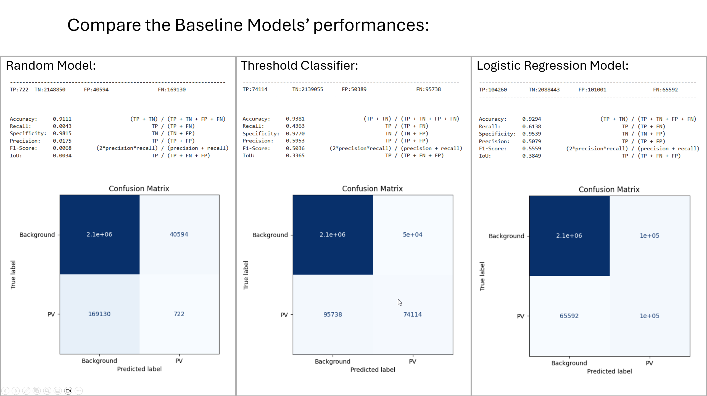

# Step 6: Benchmark Your Model

This repository contains the steps and scripts used to define reference Baseline Models, which are simple and minimalist machine learning models that serve as starting points for solving a particular task. Baseline models provide reference points to evaluate the performance of more complex models.

## Baseline Models

To establish a benchmark for evaluating the performance of more complex models, I will implement three simple baseline models:

1. **Random Model**: This model randomly classifies each pixel into the positive or negative class based on the overall class distribution in the dataset. While simplistic, it serves as a lower bound for performance and helps ensure that more advanced models are better than chance.

2. **Threshold Classifier**: This model classifies pixels based on a fixed intensity threshold for the NIR band. Pixels with intensity values below the threshold are classified as positive, while those above are classified as negative.

3. **Logistic Regression Model**: A more sophisticated approach, this model uses logistic regression to predict the class of each pixel based on its NIR intensity. By learning a probabilistic decision boundary, it provides a stronger baseline while maintaining interpretability and simplicity.

## Jupyter Notebooks

The creation and evaluation of these models are presented in the following Jupyter Notebook:

- [Benchmark](./Benchmark.ipynb) 
  

## Results
The metrics for each baseline model are summarized below:

