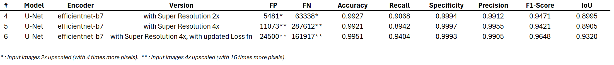

# Step 7: Experiment With Various Models

This repository contains the code, models, and supporting files developed to experiment with various approaches for modeling our dataset. The goal is to establish benchmarks and identify the most effective models for detecting photovoltaic solar panels in satellite imagery using semantic segmentation techniques.

### Tested Models and Results

The performance of the tested models is summarized in the following table:

### Further Improvements

After identifying the best-performing model (U-Net), we applied Data Augmentation and Bicubic Interpolation (2x), which resulted in additional performance improvements:

### Experiencing with Super Resolution

We experienced with Super Resolution over the samples with the model Real-ESRGAN (Credits to: [Xintao](https://github.com/xinntao/Real-ESRGAN)) with x2 and x4 upscaling. These are the obtained results:

We extracted a PV plant from the sample images at different resolutions to observe the differences in detail and pixel sizes:

---

## Repository Contents

### 1. Main Jupyter Notebooks

- [part 1](./PVdetect-modelSelection.ipynb) 
    This notebook demonstrates the initial development of five models, covering:
	
	* Data preparation.
	* Model hyperparameter configuration.
	* Training and evaluation of the models.
	
- [part 2](./PVdetect-modelSelection_part2.ipynb) 
    A continuation of the first notebook, focusing on additional experiments, including:
	
	* Data augmentation techniques.
	* Detailed analysis of model performance.
		
- [part 3](./PVdetect-modelSelection_part3.ipynb) 
    This notebooks presents the results of Experiencing with Super Resolution images
	
	* Data augmentation techniques.
	* Detailed analysis of model performance.
		

### 2. Model Tuning Log

- [history logs](./modelTuning_logs.pdf)
    A document describing the iterative model tuning process. It includes:
	
	* Insights into hyperparameter adjustments (learning rates, batch sizes, loss functions).
	* Performance metrics across various configurations.
	* Strategies for addressing class imbalance and overfitting.
		
    This document serves as a reference for understanding the trade-offs and impacts of different parameter settings.

### 3. Supporting Library

- [tools lib](./S7_tools.py)
    A Python module containing utility functions and custom classes used throughout the project. Key functionalities include:
	
	* Training and validation loops.
	* Visualization of loss and IoU metrics over epochs.
	* Custom loss functions (weighted BCE and Focal loss).
	* Confusion matrix computation and visualization.
			
			
			
