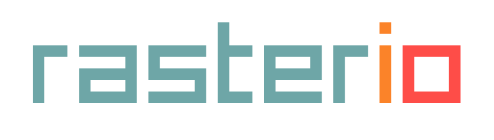
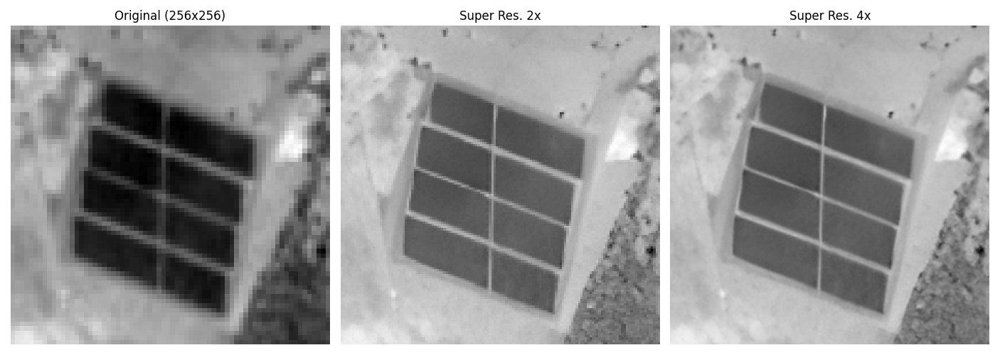

# **Automatic Detection of Photovoltaic Power Stations Using Satellite Imagery and Deep Learning**

Image Credit: ESA - European Space Agency (Sentinel-2 Program)

---
> **👷 Repository Under Construction 🚧**  
> This repository is a work in progress. I’m continually updating it with new materials, insights, and code. Stay tuned for future commits!
---

## 1. Introduction

Welcome to my Capstone Project repository for the UCSD Machine Learning Engineering Bootcamp, mentored by Artem Yankov (Google). This project aims to develop an **end-to-end ML pipeline for the automatic detection of photovoltaic (PV) power stations** using satellite imagery and deep learning via semantic segmentation.

### Context
Solar energy is one of the fastest-growing renewable energy sources worldwide, especially in regions like Brazil—where vast areas of land are suitable for solar projects. However, tracking and mapping new installations through traditional methods (e.g., manual surveys or scattered records) can be time-consuming and prone to errors. This gap calls for a **scalable, automated approach** to accurately identify solar power stations, aiding **resource planning, policy-making, and environmental impact assessments**.

Beyond this practical need, a key motivation for this project is my own **curiosity and desire to deepen my understanding** of image detection models from both academic and real-world perspectives. By applying advanced deep learning techniques to real satellite imagery, I aim to **bridge theoretical knowledge** with **hands-on technological implementation**, contributing to the broader landscape of computer vision applications.

### Objectives
1. **Create a dataset** from scratch using open-source satellite imagery curated for PV power station detection.  
2. **Define a baseline model** to establish initial performance benchmarks.  
3. **Develop a deep learning model** to identify solar plants across Brazil using satellite data.  
4. **Test multiple popular model architectures** (e.g., U-Net, U-Net++, DeepLabV3, PSPNet, and FPN).  
5. **Enhance performance** using image preprocessing techniques such as Bicubic Interpolation and **Enhanced Super Resolution GANs (ESRGAN)**.  
6. **Design an end-to-end pipeline**, encompassing data ingestion, model training, evaluation, and deployment.  
7. **Deploy** the solution in a manner that can be demonstrated or integrated into real-world systems.

---

## 2. Highlights

Here are a few key points:

### A. [Brazil Data Cube](https://data.inpe.br/bdc/web/en/home-page-2/) 
We use open images from the Sentinel-2 program available at Brazil Data Cube, which is a research, development, and technological innovation project of the National Institute for Space Research (INPE), Brazil. It produces datasets from large volumes of medium-resolution remote sensing images for the entire national territory. The project also develops a computational platform to process and analyze these datasets using artificial intelligence, machine learning, and image time series analysis.

### B. Dataset Creation 
We created a dataset from scratch with **272 images** coming from **16 photovoltaic plants** of various distributions, sizes, and surroundings, aiming for good generalization. To expand our samples, we captured multiple random scenes over each plant and applied **data augmentation** to reduce overfitting.

| **Sets**    | **Number of Areas** | **Number of Images** |
|-------------|---------------------|----------------------|
| Training    |         11          |       201 (74%)     |
| Validation  |          2          |        27 (10%)     |
| Test        |          3          |        44 (16%)     |

Labeling was performed using an ad-hoc “auto-mask” script, followed by manual edits in QGIS.

### C. Performance Achieved
We achieved the following metrics: **IoU = 94.62%** and **F1-Score = 97.23%**, using a U-Net model pre-trained on ImageNet with an EfficientNet-B7 encoder. We also applied **bicubic interpolation** (2× scaling) to improve resolution.

### D. Use of Popular Tools and Libraries

  
  
  
  
  
  
  
  
  
  
  
  
  
  
  
  

### E. Customized Loss Function
We obtained our best results using a **weighted loss function** composed of:
- **Binary Cross Entropy**
- **Focal Loss**
- **Jaccard Index**

We also experimented with **Dice Loss**, but found the above combination to yield better performance overall.

### F. Resulting Images and Debugging Techniques

#### More Predictions

### G. Experiments with Image Enhancement
We tested **bicubic interpolation** and **Enhanced Super Resolution GANs (ESRGAN)** as image-enhancement methods over the original dataset.

---

## 3. Structure
Below is an overview of the repository and the steps in my process. Each folder contains notebooks, scripts, or related files for that phase:

- **[Step 1 - Start Planning my Capstone](./1-Planning_my_Capstone/Step1_StartPlanning_my_Capstone_Project.pdf)**  
  Define the possible project scopes and initial feasibility assessment based on research and mentor discussions.

- **[Step 2 - Collect Your Data](./2-EDA)**  
  Basic Exploratory Data Analysis (EDA) and data collection strategies.

- **[Step 3 - Project Proporsal](./3-Project_Proposal/Step3_ProjectProposal)**  
  Formalize the project plan by outlining objectives, methodology, expected outcomes, and potential challenges.

- **[Step 4 - Survey Existing Research and Reproduce Available Solutions](./4-Survey_Existing_Research)**  
  Literature review and attempts at reproducing known solutions.

- **[Step 5 - Data Wrangling & Exploration](./5-Data_Wrangling)**  
  Data cleaning, feature engineering, and exploratory analysis.

- **[Step 6 - Benchmark Your Model](./6-Benchmark_your_model)**  
  Initial benchmarking with a baseline model or known methods.

- **[Step 7 - Experiment with Various Models](./7-Experiment_with_various_Models)**  
  Iterative experimentation with different ML/DL approaches.

- **[Step 8 - Scale the ML Prototype](./8-Scaling_the_Prototype)**  
  Approaches for taking the model from proof-of-concept to production scale.

> **Note**: You might notice missing steps (like Step 1 or Step 3) if they’re part of the broader Bootcamp curriculum but not included here yet. Check back soon for updates!

---

## 4. Credits
I’d like to acknowledge the following:

- **UCSD ML Engineering Bootcamp** — for providing a comprehensive and complete curriculum and unwavering support throughout the learning journey  
- **My mentor: Artem Yankov (Google)** — for his valuable guidance and support  
- **Open-Source Community** — for making data science accessible  
- **My Family** — for supporting me during this learning phase 😅

---

### Contact Information
If you have any suggestions, questions, or just want to connect:

- **Email**: [federico.bessi@gmail.com](mailto:federico.bessi@gmail.com)  
- **LinkedIn**: [Federico Bessi](https://www.linkedin.com/in/federicobessi)

---

This project is licensed under the Apache License 2.0. See the [LICENSE](./LICENSE) file for details.
